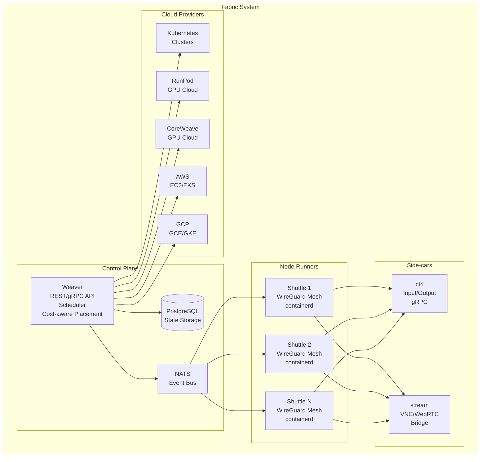

# Fabric - Weaver Control Plane

Weaver is the control plane component of the Fabric system, providing REST/gRPC APIs for workload scheduling and management across multiple cloud providers.

## Architecture



### Component Overview
- **Control Plane (Weaver)**: REST/gRPC API, scheduler, cost-aware placement, provider drivers
- **Node Runner (Shuttle)**: Joins WireGuard mesh, manages workloads via containerd
- **Side-cars**: ctrl (input/output), stream (VNC/WebRTC bridge)

## Features

- Multi-cloud workload scheduling (K8s, RunPod, CoreWeave, AWS, GCP)
- Cost-aware placement optimization
- Provider abstraction layer
- REST API for workload management
- Configuration via CLI flags, config files, or environment variables

## Quick Start

### Build

```bash
go build -o weaver ./cmd/weaver
```

### Run

```bash
# With default settings (K8s provider enabled)
./weaver --k-8-s-enabled

# With custom config
./weaver --config config.yaml

# See all options
./weaver --help
```

### Configuration

Configuration can be provided via:
1. Command line flags
2. YAML config file
3. Environment variables

Example config.yaml:
```yaml
server:
  address: ":8080"

database:
  host: "localhost"
  port: 5432
  user: "fabric"
  password: "fabric"
  database: "fabric"

nats:
  url: "nats://localhost:4222"

providers:
  k8s:
    enabled: true
    namespace: "default"
  runpod:
    enabled: false
    api_key: ""
  coreweave:
    enabled: false
    api_key: ""
```

## API Endpoints

### Health Check
- `GET /health` - Service health status

### Workload Management
- `POST /v1/workloads` - Create workload
- `GET /v1/workloads/:id` - Get workload status
- `DELETE /v1/workloads/:id` - Delete workload
- `GET /v1/workloads` - List workloads

### Provider Information
- `GET /v1/providers` - List available providers
- `GET /v1/providers/:name/regions` - List provider regions
- `GET /v1/providers/:name/machine-types` - List provider machine types

### Scheduler
- `GET /v1/scheduler/status` - Scheduler status

## Providers

### Kubernetes (K8s)
- Local or remote Kubernetes clusters
- Pod-based workload execution
- Resource quotas and limits

### RunPod
- GPU-focused cloud provider
- RTX 4090, RTX 4080, A100, H100 instances
- API-based provisioning

### CoreWeave
- High-performance GPU cloud
- A6000, A100, H100 instances
- Multiple regions (Chicago, New York, Las Vegas)

## Development

### Project Structure
```
cmd/weaver/          # Main application entry point
internal/
  api/               # REST API handlers and routes
  config/            # Configuration management
  provider/          # Provider interface and implementations
    k8s/             # Kubernetes provider
    runpod/          # RunPod provider
    coreweave/       # CoreWeave provider
  scheduler/         # Workload scheduling logic
  state/             # Application state management
images/              # Docker images
```

### Adding New Providers

1. Create new provider package in `internal/provider/`
2. Implement the `Provider` interface
3. Add configuration struct to `internal/config/`
4. Register provider in `internal/state/state.go`

## Dependencies

- PostgreSQL (for state storage)
- NATS (for event publishing)
- Kubernetes cluster (if using K8s provider)
- Provider API keys (for cloud providers)

## Docker

Build and run with Docker:

```bash
docker build -f images/Dockerfile.weaver -t weaver .
docker run -p 8080:8080 weaver
