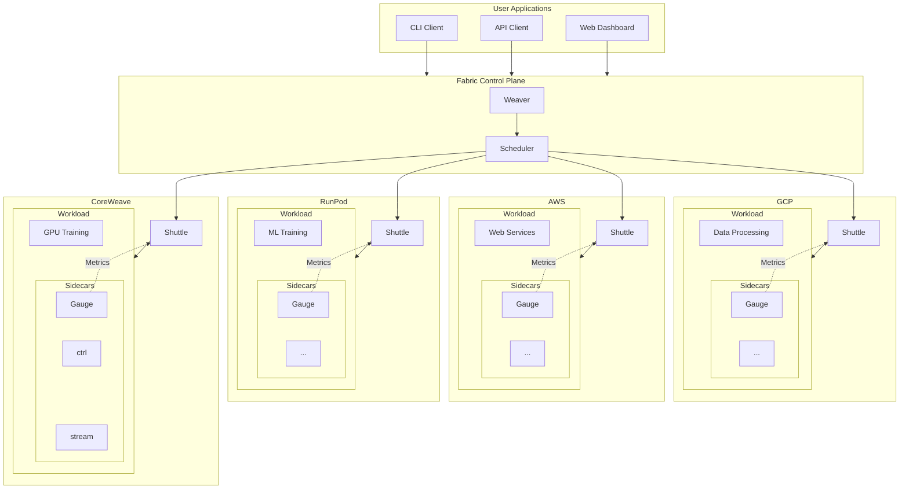
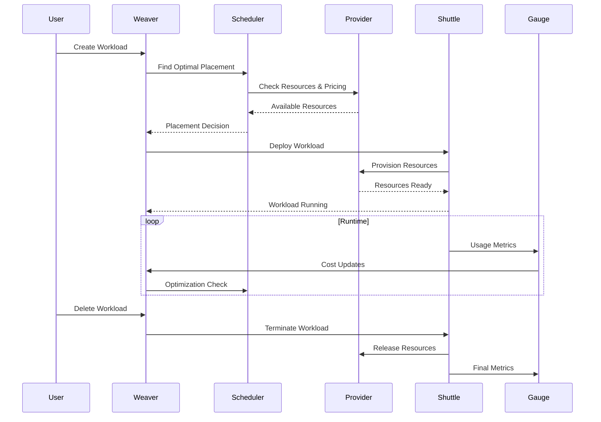

# Fabric

A distributed workload orchestration system for cross-cloud computing, built from the ground up for modern cloud-native applications.

## The Problem

Modern applications need to run across multiple cloud providers to optimize for cost, performance, and availability. However, existing solutions are either:

- **Cloud-specific** - Lock you into a single provider
- **Complex** - Require extensive configuration and management overhead
- **Inefficient** - Don't optimize for cost or performance across providers
- **Insecure** - Lack proper networking and isolation between distributed workloads

Fabric solves these challenges by providing a unified orchestration layer that intelligently schedules workloads across any cloud provider while maintaining security, performance, and cost efficiency.

## Solution Overview

Fabric provides a complete cross-cloud orchestration platform with three core principles:

1. **Intelligent Scheduling** - Cost-aware placement with real-time optimization
2. **Secure Networking** - Zero-trust mesh networking across all providers
3. **Unified Management** - Single API for all cloud resources



## Architecture

Fabric consists of two main components and supporting sidecars:

### 🎯 Weaver (Control Plane)

The brain of the system - makes intelligent scheduling decisions and manages the global state.

**Key Responsibilities:**
- **Workload Scheduling** - Determines optimal placement across providers
- **Cost Optimization** - Real-time cost analysis and optimization
- **State Management** - Maintains global view of all resources
- **API Gateway** - Unified gRPC API for all operations
- **Access Control** - Secure proxy for workload access

**Core Components:**
- gRPC API with protobuf definitions
- Scheduler engine with multiple strategies
- Provider drivers (CoreWeave, RunPod, GCP, K8s, KubeVirt, Nosana, AWS-Mac)
- State store (PostgreSQL) with event streaming (NATS)
- Snapshot management (CRIU → Iroh CID)

### 🚀 Shuttle (Node Runner)

The execution engine - runs on compute nodes and manages workload lifecycle.

**Key Responsibilities:**
- **Container Runtime** - Manages containers with multiple runtime support
- **Mesh Networking** - Secure WireGuard mesh via Tailscale
- **Resource Monitoring** - Real-time usage tracking and reporting
- **Workload Isolation** - Security boundaries between workloads
- **Sidecar Management** - Deploys and manages sidecar containers

**Core Components:**
- containerd integration with runc, Firecracker, and Kata support
- Tailscale mesh networking for secure cross-cloud communication
- Sidecar orchestration and lifecycle management
- Host-level resource monitoring and reporting

## Sidecar Services

Fabric supports declarative sidecar containers launched by Shuttle for enhanced functionality:

### 📊 Gauge (Metering Sidecar)
- **Usage Tracking** - Monitors workload resource consumption in real-time
- **Billing Integration** - OpenMeter integration for precise billing
- **Analytics** - Usage patterns and optimization insights
- **Deployment** - Runs as a sidecar alongside each workload container

### 🎮 Control & Streaming Sidecars
- **ctrl** - Keyboard/mouse/screenshot gRPC service for remote control
- **stream** - VNC/WebRTC bridge for remote desktop access

## Intelligent Scheduling

Fabric's scheduler makes optimal placement decisions based on multiple factors:

**Scheduling Strategies:**
- **`lowest_cost`** - Minimize hourly costs across all providers
- **`best_performance`** - Optimize for compute performance and GPU availability
- **`balanced`** - Balance cost, performance, and reliability
- **`high_availability`** - Prioritize uptime and fault tolerance
- **`custom`** - User-defined weights and constraints

**Scheduling Factors:**
- Cost analysis across providers
- Performance requirements (CPU, memory, GPU)
- Provider availability and capacity
- Network latency and compliance rules
- Resource constraints and preferences

## Secure Mesh Networking

All Fabric nodes communicate through a secure WireGuard mesh via Tailscale, providing zero-trust networking across cloud boundaries. This enables:

- **Encrypted Communication** - All traffic between nodes is encrypted
- **NAT Traversal** - Automatic connectivity across different network topologies
- **Peer-to-Peer** - Direct communication between nodes when possible
- **Cross-Cloud** - Seamless networking across different cloud providers

## Workload Lifecycle

From creation to termination, Fabric manages the complete workload lifecycle:



## Quick Start

### Prerequisites

- Go 1.24+
- Protocol Buffers compiler (`protoc`)
- PostgreSQL (for state storage)
- NATS (for event streaming)

### Building

```bash
# Build all components
make build

# Or build individually
make weaver  # Control plane
make shuttle # Node runner
make gauge   # Metering sidecar
```

### Running

```bash
# Start control plane
./bin/weaver

# Start node runners (on each compute node)
./bin/shuttle

# Gauge sidecars are automatically deployed by Shuttle alongside workloads
```

## Use Cases

### 🎮 GPU-Intensive Workloads
- **AI/ML Training** - Automatically find cheapest GPU resources across CoreWeave, RunPod, AWS
- **Rendering** - Burst to cloud GPUs when local capacity is exceeded
- **Gaming** - Deploy game servers close to players with cost optimization

### 🌐 Multi-Region Applications
- **Global Web Services** - Deploy close to users while optimizing costs
- **Data Processing** - Move compute to data location automatically
- **Disaster Recovery** - Automatic failover across cloud providers

### 💰 Cost Optimization
- **Spot Instance Management** - Intelligent spot instance usage across providers
- **Right-sizing** - Automatic resource optimization based on usage patterns
- **Provider Arbitrage** - Take advantage of pricing differences between clouds

### 🔒 Compliance & Security
- **Data Sovereignty** - Keep data in specific regions/countries
- **Zero-Trust Networking** - Secure communication across all environments
- **Audit Trails** - Complete visibility into workload placement and access

## API Reference

Fabric exposes a comprehensive gRPC API:

- **Workload Management** - Create, read, update, delete workloads
- **Provider Operations** - List providers, regions, machine types
- **Scheduler Control** - Get recommendations, force placement, view stats
- **Monitoring** - Health checks, metrics, usage data

## Contributing

Fabric is built with modularity in mind. Each component can be developed and tested independently:

```bash
# Test individual modules
go test ./weaver/...
go test ./shuttle/...
go test ./gauge/...

# Format code
make fmt

# Generate protobuf
make proto
```

## License

[License information]
