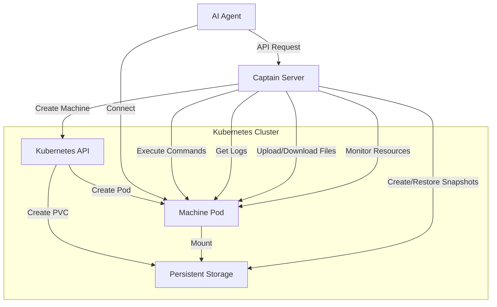
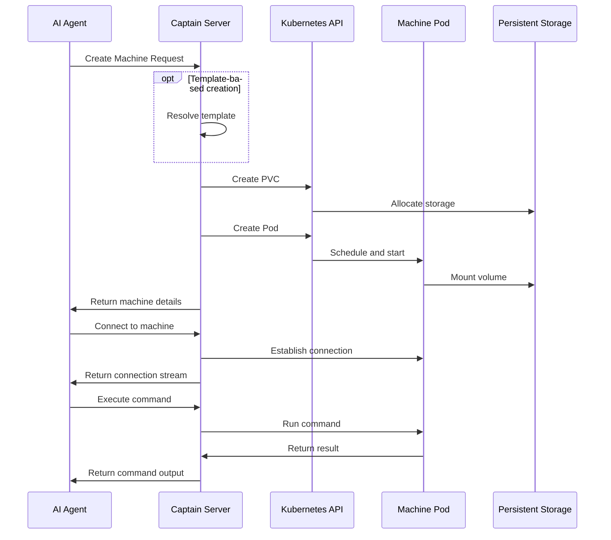

# Captain 

> [!WARNING]  
> This project is still in progress. Updates are coming soon and APIs may change.

Core infrastructure component for CodecFlow - a platform providing on-demand cloud desktops for AI agents.

## What is Captain?

Captain is a Kubernetes-based service that provisions and manages virtual machines for AI agents. It enables:

- Secure machine provisioning in Trusted Execution Environments (TEE)
- Model Context Protocol (MCP) integration for AI agent communication
- Command execution and file transfers
- Resource monitoring and snapshot management

## Architecture

Built on Kubernetes for scalability and reliability, Captain provides isolated environments for AI agents to perform OS-level tasks securely.

## Request Flow

The following diagram illustrates the flow of a machine creation request:

## TODO

- [ ] Add authentication and authorization
- [x] Implement resource quotas and limits
- [x] Add support for custom machine templates
- [ ] Enhance monitoring with Prometheus integration
- [ ] Improve documentation and API reference
- [ ] Implement automated testing
- [ ] Add support for GPU acceleration
- [ ] Implement network isolation between machines
- [x] Add machine health checks and auto-recovery
- [ ] Support for multiple cloud providers
- [ ] Add Firecracker support for lightweight virtualization
